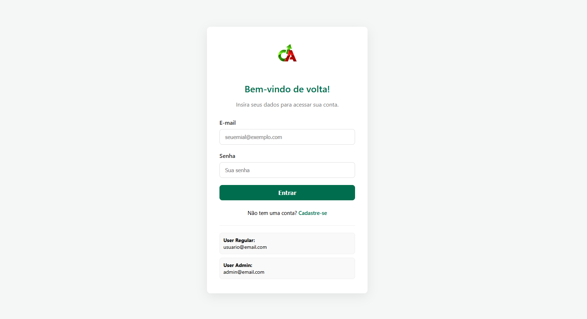
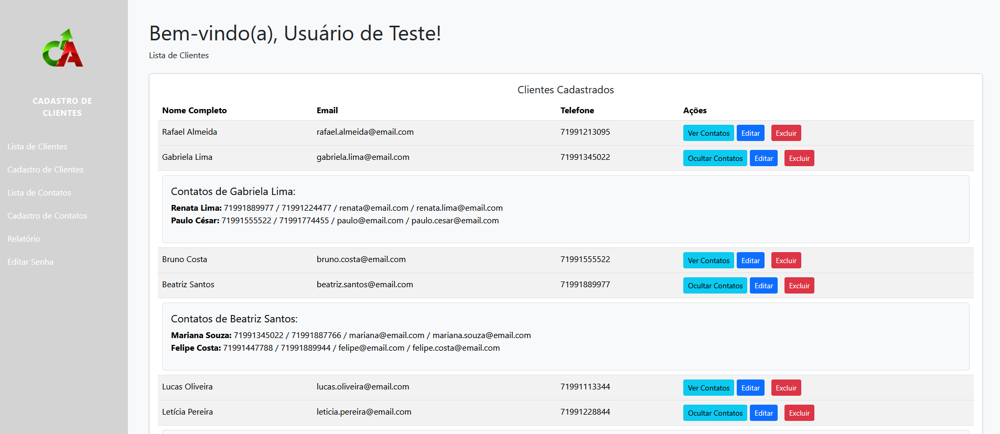

<p align="center">
  
  
  
  
  
</p>

<p align="center">
  <a href="https://ca-crm-lufu.onrender.com" target="_blank">
    
  </a>
</p>

<h1 align="center">Cadastro de Clientes - C.A</h1>

<p align="center">
  Sistema Full-Stack de Gerenciamento de Clientes (CRM) construído com <b>Java</b> e <b>Spring Boot</b>.<br>
  Inclui autenticação, CRUD completo, e geração de relatórios em PDF. 
</p>

---

## Funcionalidades

### Autenticação
- Sistema completo de **Login e Registro** de usuários.  
- **Autenticação baseada em sessão** (cookies) com Spring Security.  
- **Autorização baseada em papéis** (`ADMIN`, `REGULAR`).  
- Página de **"Editar Senha"** para o usuário logado.  

### Clientes (CRUD)
- **Cadastro, Leitura, Atualização e Exclusão (CRUD)** de Clientes.  
- **Validação de formulário** (ex: “E-mail já cadastrado”).  
- **Validação inteligente** de e-mail duplicado (ignora o e-mail do próprio usuário ao editar).  

### Contatos (CRUD)
- CRUD completo de **Contatos**.  
- **Validação de exclusão** para impedir que contatos vinculados a clientes sejam apagados (Integridade Referencial).  

### Relacionamentos
- **Relacionamento Many-to-Many** entre Clientes e Contatos.  
- Formulário de cadastro/edição com campo **`<select multiple>`** para vincular contatos.  
- **Listagem aninhada (accordion)** para mostrar contatos de cada cliente.  

### Relatórios
- **Geração de Relatórios** de Clientes e Contatos em tela.  
- **Exportação em PDF** com **Flying Saucer** (`org.xhtmlrenderer`).  

---

## Screenshots

<p align="center">
  <b>Tela de Login</b><br>
  
</p>
<p align="center">
  <b>Lista de Clientes (com contatos)</b><br>
  
</p>

---

## Stack de Tecnologia

### Backend
- Java 21  
- Spring Boot   
- Spring MVC (Web)  
- Spring Data JPA (Hibernate)  
- Spring Security  

### Frontend
- Thymeleaf (Server-Side Rendering)  
- HTML / CSS
- Bootstrap  
- JavaScript

### Deploy
- Render (pelo DockerHub)
- Docker 

### Banco de Dados
- **H2 Database** (desenvolvimento e testes)  
- **PostgreSQL** (produção)  

### Geração de PDF
- **Flying Saucer** (`org.xhtmlrenderer`)  

---

## Estrutura do Projeto

📦 cadastro  
 ┣ 📂 src  
 ┃ ┣ 📂 main  
 ┃ ┃ ┣ 📂 java/com/essjr/Cadastro  
 ┃ ┃ ┃ ┣ 📜 CadastroApplication.java  
 ┃ ┃ ┃ ┣ 📜 DataLoader.java  
 ┃ ┃ ┃ ┣ 📂 appUser  
 ┃ ┃ ┃ ┣ 📂 auth  
 ┃ ┃ ┃ ┣ 📂 cliente  
 ┃ ┃ ┃ ┣ 📂 config  
 ┃ ┃ ┃ ┣ 📂 contato  
 ┃ ┃ ┃ ┣ 📂 exceptions  
 ┃ ┃ ┃ ┣ 📂 relatorio  
 ┃ ┃ ┃ ┗ 📂 security  
 ┃ ┗ 📂 resources  
 ┃ ┃ ┣ 📜 application.properties  
 ┃ ┃ ┣ 📂 templates  
 ┃ ┃ ┗ 📂 static  
 ┣ 📜 docker-compose.yml  
 ┣ 📜 Dockerfile  
 ┣ 📜 README.md  
 ┗ 📜 pom.xml  

---

## Endpoints do Projeto

| Módulo | Tipo | Método | Endpoint | Descrição | Detalhes (HTTP/Tipo) |
| :--- | :--- | :--- | :--- | :--- | :--- |
| **Clientes** | **API REST** | GET | `/api/clientes` | Lista todos os clientes cadastrados | 200 OK |
| **Clientes** | **API REST** | GET | `/api/clientes/{id}` | Busca cliente pelo ID | 200 OK, 404 Not Found |
| **Clientes** | **API REST** | POST | `/api/clientes` | Cadastra um novo cliente | 201 Created, 400 Bad Request |
| **Clientes** | **API REST** | PUT | `/api/clientes/{id}` | Atualiza um cliente existente | 200 OK, 404 Not Found |
| **Clientes** | **API REST** | DELETE | `/api/clientes/{id}` | Exclui cliente pelo ID | 204 No Content, 404 Not Found |
| **Contatos** | **API REST** | GET | `/api/contatos` | Lista todos os contatos | 200 OK |
| **Contatos** | **API REST** | GET | `/api/contatos/{id}` | Busca contato por ID | 200 OK, 404 Not Found |
| **Contatos** | **API REST** | POST | `/api/contatos` | Cadastra novo contato | 201 Created, 400 Bad Request |
| **Contatos** | **API REST** | PUT | `/api/contatos/{id}` | Atualiza contato existente | 200 OK, 404 Not Found |
| **Contatos** | **API REST** | DELETE | `/api/contatos/{id}` | Exclui contato por ID | 204 No Content, 404 Not Found |
| **Clientes** | **Web** | GET | `/cliente/cadastro` | Exibe o formulário de cadastro de cliente | Página |
| **Clientes** | **Web** | POST | `/cliente/cadastro` | Processa o formulário de cadastro | Ação |
| **Clientes** | **Web** | GET | `/cliente/lista` | Exibe lista de clientes cadastrados | Página |
| **Clientes** | **Web** | GET | `/cliente/editar/{id}` | Exibe o formulário de edição de cliente | Página |
| **Clientes** | **Web** | POST | `/cliente/editar/{id}` | Atualiza um cliente existente | Ação |
| **Clientes** | **Web** | POST | `/cliente/excluir/{id}` | Exclui um cliente e redireciona | Ação |
| **Clientes** | **Web** | GET | `/cliente/cliente/{clienteId}/contatos` | Lista contatos de um cliente específico | Página |
| **Contatos** | **Web** | GET | `/contato/cadastro` | Exibe o formulário de cadastro de contato | Página |
| **Contatos** | **Web** | POST | `/contato/cadastro` | Processa o cadastro de contato | Ação |
| **Contatos** | **Web** | GET | `/contato/lista` | Lista todos os contatos cadastrados | Página |
| **Contatos** | **Web** | GET | `/contato/editar/{id}` | Exibe formulário de edição de contato | Página |
| **Contatos** | **Web** | POST | `/contato/editar/{id}` | Atualiza um contato existente | Ação |
| **Contatos** | **Web** | POST | `/contato/excluir/{id}` | Exclui contato e redireciona | Ação |
| **Relatórios** | **Web** | GET | `/relatorio` | Exibe o relatório de clientes em tela | Página |
| **Relatórios** | **Web** | GET | `/relatorio/pdf` | Gera e faz download do relatório em PDF | Download |

---

## Como Rodar o Projeto

### Pré-requisitos
- **JDK 21** ou superior  
- **Apache Maven**  
- Uma IDE (IntelliJ, VS Code, Eclipse, etc.)

### Clone o Repositório
```bash
git clone https://github.com/evandrossjr/Cadastro.git
```
### Acesse o Repositório
```bash
   cd cadastro
   ```

### Banco de Dados

- O projeto está rodando com o o banco em H2 em memória (spring.jpa.hibernate.ddl-auto=create) junto com um arquivo DataLoader.java para popular o banco de dados na inicialização (Configuração realizada no `application.properties` e no `application-test.properties`;

- Configuração para PostgreSQl
```
spring.datasource.url=jdbc:postgresql://localhost:5432/seu_banco
spring.datasource.username=seu_usuario
spring.datasource.password=sua_senha
spring.jpa.hibernate.ddl-auto=update
```

### Execute a Aplicação
- Via IDE abra a classe principal CadastroApplication.java e clique em **Run**
- Via Maven (terminal)
```
- mvn spring-boot:run
```

### Acesse o sistema
- Acesse pelo navegador: 
http://localhost:8080
 
### Documentação da API
- Após rodar o projeto, acesse a documentação interativa do Swagger em: 
http://localhost:8080/swagger-ui.html

    
### Acesse tambem pela web 
- O projeto está hospedado no Render e pode demorar cerca de 5 minutos para subir a aplicação: 
https://ca-crm-lufu.onrender.com
 
  
    
---

## Usuários de Demonstração

O sistema cria automaticamente dois usuários (via DataLoader.java) caso o banco esteja vazio:

 Tipo de Usuário | E-mail | Senha |
|:---------------:|:------:|:-----:|
| **Admin**  | admin@email.com | admin122 |
| **Regular** | usuario@email.com | senha123 |

---

## Autor

- **Evandro Sacramento**
- [GitHub](https://github.com/evandrossjr)
- [Linkedin](https://www.linkedin.com/in/evandrosacramento/)
- [evandro-dev@outlook.com](mailto:evandro-dev@outlook.com)

